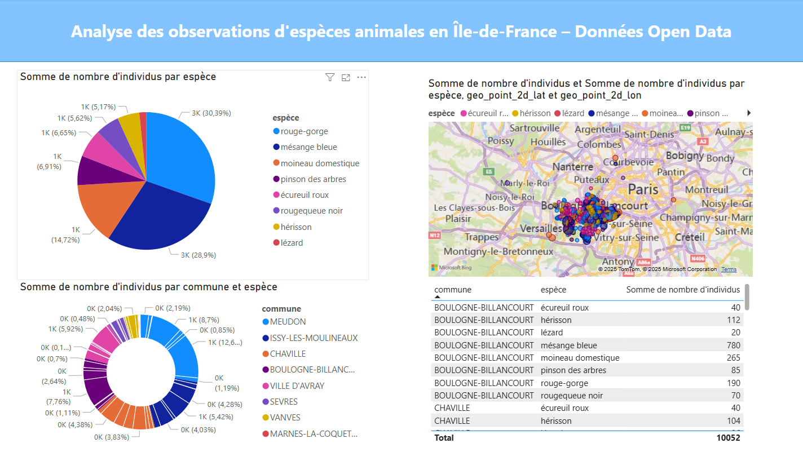

# 🐦 Pipeline de Données Biodiversité (Open Data)

Ce projet personnel met en œuvre un pipeline de données complet pour l’analyse de la biodiversité urbaine à partir de données Open Data.

## 📌 Objectifs

- Collecter des données publiques sur les observations d’animaux en Île-de-France
- Construire un pipeline de traitement et de visualisation
- Mettre en pratique des outils modernes de la data (ETL, API, Docker, DataViz)

---

## 🧰 Technologies utilisées

| Étape            | Outils                        |
|------------------|-------------------------------|
| Extraction       | Scripts Python, fichiers JSON |
| Stockage         | PostgreSQL (via Docker)       |
| Traitement       | SQLAlchemy, ORM               |
| API              | FastAPI                       |
| Visualisation    | Power BI                      |
| Conteneurisation | Docker, Docker Compose        |

---

## 🧪 Étapes du projet

1. **Extraction**
   - Données brutes récupérées depuis la plateforme Open Data.
   - Format initial : JSON.

2. **Chargement (Load)**
   - Insertion dans une base de données PostgreSQL grâce à SQLAlchemy.

3. **API**
   - Création d’une API REST avec FastAPI pour exposer les données.
   - Documentation interactive via Swagger (`/docs`).

4. **Visualisation**
   - Connexion Power BI à PostgreSQL.
   - Visualisation des observations : répartition par espèce, commune, carte interactive.

---

## 🔍 Aperçu des visualisations



---

## 🚀 Lancer le projet

1. Cloner le dépôt :
```bash
git clone https://github.com/votre-utilisateur/pipeline-biodiversite.git
cd pipeline-biodiversite


2. Lancer les services avec Docker :

docker-compose up 


3. Accéder à l’API :

Swagger UI : http://localhost:8000/docs


---

## 📁 Arborescence du projet
.
├── app
│   ├── Files
│   	  └── Tous les fichiers JSON à traiter
│   ├── __init__.py
│   ├── main.py
│   ├── models.py
│   ├── schema.py
│   ├── loadData.py
│   └── database.py
├── docker-compose.yml
├── requirements.txt
├── README.md
├── Tableau_de_bord_Power_BI.pbix
└── CapturePowerBI.png